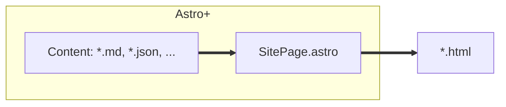
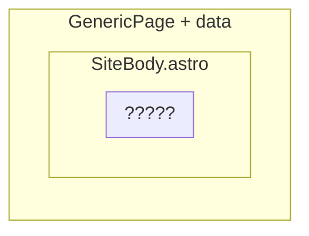
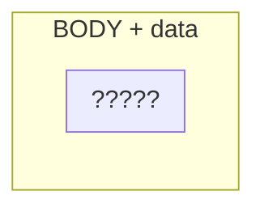

# Application Architecture

## Astro usage

I use [Astro](https://astro.build) on my this site to:

- Compose [HTML]() tags
  into reusable components: .astro files
- Hydrate .astro files into HTML files
  by using data in the form of
  [Markdown](), [JSON](), [JavaScript](), etc.

Aside from Astro bit,
I strive to build this site
using standard [HTML](), [CSS](), and [JavaScript]().

Inline scripts and third-party static imports
via JavaScript and CSS are explicitly encouraged.

```html
<script type="module">
  import from "...";
  // do something
</script>
<script type="module" src="..."></script>
<style>
  @import "...";
  /* style something */
</style>
<link rel="stylesheet" href="..." />
```

Though Astro supports them,
component libraries and frameworks
that require a build steps ([Solid](), [React](), [Vue](),...)
are discouraged in favor of native [WebComponents](),
which have widespread support.

Likewise, preprocessors ([sass](), [postcss](), [babel](),...) are discouraged in favor of moder web standards.

However; using these is not out of the question.

## SitePage.astro and SiteBody.astro

TLDR; If you want to clone + customize this site, focus on modifying these two files.

**src/components/SitePage.astro** is the main component
of this site.
It contains
basic style, functionality, and content
common throughout the site.

Every HTML page on this site is created by hydrating SitePage.astro with some content.



It's created by adding site-specific data
to [Astro Plain](), a generic template,
and composing it with a sub-template,
_SiteBody.astro_.



**src/components/SiteBody.astro** --
itself composed of site-specific data added to HTML tags -- provides a convinient way of controlling the visible Elements of a page via placment and application of attributes.



Styling/functionaity is left to whatever's passed to the GenericPage.astro component.
