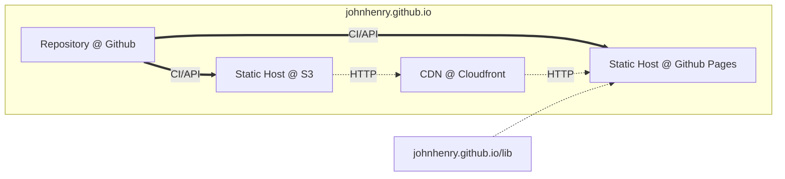
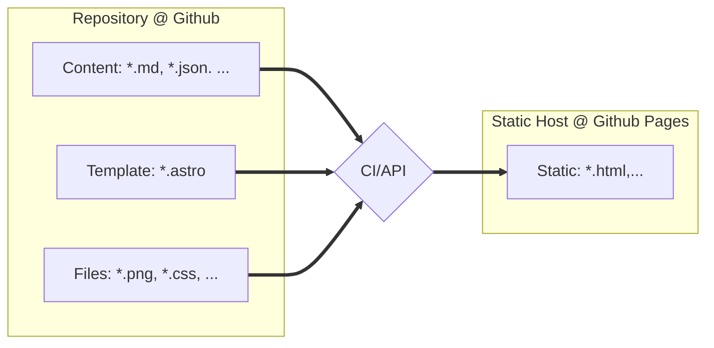
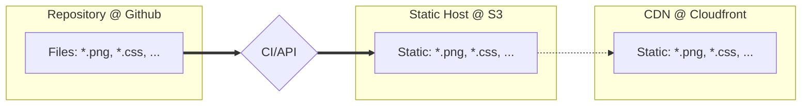

# Deployment Architecture

The main code for the application is located in [this repository](https://github.com/johnhenry/johnhenry.github.io) located on [Github]().

The application uses [Github Actions]() to build and deploy a static host at [Github Pages]().

Github Actions is also used to move files in the "public" directory to a bucket in [Amazon S3](). Thse files are then cached in a CDN on [Amazon Cloudfront]().

Along with static files from the CDN, the application makes use of heavy use of files served from the 'lib' directory, which is built using a slightly different process and hosted at [https://johnhenry.github.io/lib](https://johnhenry.github.io/lib)



<hr />



<hr />



## Modularity

The site is built to a specific branch, [static]().

Other static host can be pointed to this here.

Mirrors of this site can be found here:

- []() [Netlify]()
- []() [Vercel]()
- []() [Fleek]()
- []() [Cloudflare Pages]()
- []() [AWS]()
- []() [Microsoft]()
- []() [Google]()

Github Actions can be replaced with other continuous integration systems. [nektos/act](github.com/nektos/act) can be installed on a server and can probably run the actions with few tweeks. (This is not tested).
```
